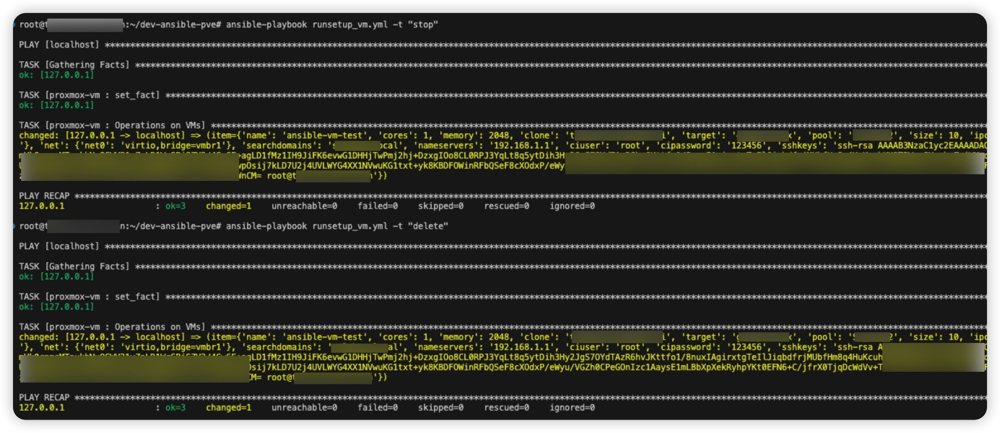

Table of Content
---------------------------------------------

- [VM Management](#vm-management)
  - [Requirements](#requirements)
  - [Role Variables](#role-variables)
  - [Dependencies](#dependencies)
  - [Usage](#usage)
- [Mount New Disk](#mount-new-disk)
  - [Requirements](#requirements-1)
  - [Dependencies](#dependencies-1)
  - [Usage](#usage-1)
- [Container Management](#container-management)
  - [Usage](#usage-2)
----------------------------------------------

**Note**
This repo is re-built based on [Ansible role to create/delete VM/containers on proxmox](https://github.com/pvelati/ansible-role-proxmox-kvm-mgmt/tree/master) as I encountered some issues by using his ansible roles within my env.

Fixed issue list:
1. When using vm template to clone a new VM, bootdisk can't be resized. Resolve by running proxmox rest api to resize the bootdisk size.
2. The VM can't be started after creation. Resolve by adding some sleeping time between main steps.
3. Ansible role to create/delete containter is not included.
4. Ansible role to mount new disk is not included.


# VM management

## Requirements

See requirements.txt.

Use this command to install all requirements:

```bash
python3 -m pip install --user -r requirements.txt

ansible-galaxy collection install community.general
```

Export your vault_pass(Save the vault pass in a safe place, you'll need it to encrypt/decrypt existing vault file)

```bash
set +o history
export VAULT_PASSWORD=CHANGEME
set -o history
```

Modify and setup proxmox credentials in `./roles/ansible-proxmox-vm/defaults/main.yml`


**Note: Only `root@pam` account is accepted for full management.**


And then encrpyt it with ansible-vault
```bash
ansible-vault encrypt ./roles/ansible-proxmox-vm/defaults/main.yml
```

## Role Variables
See `./roles/ansible-proxmox-vm/defaults/globals.yml` for the complete list of variables.

See also [proxmox_kvm](https://docs.ansible.com/ansible/latest/modules/proxmox_kvm_module.html) module page.

## Dependencies
Module community.general.proxmox_kvm that can be found in collection community.general.

## Usage
Define a list of virtual machines in this format:

```bash
vm_list:
  - name: ansible-vm-test
    cores: 1
    memory: 2048
    clone: 'template-ubuntu2204-ci'
    #ostype: 'l26'
    target: 'home-proxmox'
    pool: 'test-local'
    ipconfig:
      ipconfig0: 'ip=dhcp'
      #ipconfig0: 'ip=192.168.1.2/26, gw=192.168.1.1'
    net:
      net0: 'virtio,bridge=vmbr1'
    searchdomains: 'homelab.mylocal'
    nameservers: '192.168.1.1'
    ciuser: 'root'
    cipassword: 'CHANGEME123' # password of the new vm, no need to specify it if using ssh key
    sshkeys: 'ssh-rsa AxxxxCM= root@my-pc'
```

If you don't want to creat new vmlist file as vars, the default one under `./roles/ansible-proxmox-vm/defaults/main/vmlist` will be used.

Execute playbook with tags:
```bash
# To create VMs as defined under `./roles/ansible-proxmox-vm/defaults/main/vmlist`
ansible-playbook runsetup_vm.yml -t "create"
```


```bash
# To destroy VMs as defined under `./roles/ansible-proxmox-vm/defaults/main/vmlist`
ansible-playbook runsetup_vm.yml -t "stop" # stop the vm before destroy it
ansible-playbook runsetup_vm.yml -t "delete"
```


# Mount new disk
If you wan to add additional disk other than the boot disk, try `disk-mount` role.

## Requirements

Export your vault_pass (ignore this step if it's done)

```bash
set +o history
export VAULT_PASSWORD=CHANGEME
set -o history
```

Modify and setup proxmox credentials in `./roles/disk-mount/vars/main.yml`

And then encrpyt it with ansible-vault
```bash
ansible-vault encrypt ./roles/disk-mount/vars/main.yml
```

## Dependencies
Module community.general.proxmox_kvm that can be found in collection community.general.

## Usage
By default, `sdb` device will be added after assigning new disk to a VM at the first time and `scsi1` will be used to set the disk name.
More settings, check `./roles/disk-mount/defaults/main.yml`

Check `inventory` to ensure the VM is defined correctly under `vm_mount` section.

Execute playbook with tags:
```bash
ansible-playbook runsetup_mount_sdb.yml -t "mount"
```


# Container Management
Same requriements and dependencies with VM management.

## Usage
Define a list of virtual machines in this format:


```bash
vm_list:
  - hostname: ansible-ct-test
    cores: 1
    memory: 2048
    ostemplate: 'local:vztmpl/ubuntu-standard_amd64.tar.zst'
    pool: 'test-local'
    disk: 5
    netif:
      net0: 'name=eth0,ip=dhcp,bridge=vmbr1'
    searchdomain: 'homelab.mylocal'
    nameserver: '192.168.1.1'
    password: 'CHANGEME123'
    pubkey: 'ssh-rsa xxxxxxxxCM= root@MY-PC'
```

If you don't want to creat new vmlist file as vars, the default one under `./roles/ansible-proxmox-vm/defaults/main/vmlist` will be used.

Execute playbook with tags:
```bash
# To create and start containers as defined under `./roles/ansible-proxmox-ct/defaults/main/vmlist`
ansible-playbook runsetup_ct.yml -t "create"
ansible-playbook runsetup_ct.yml -t "start"
```


```bash
# To destroy VMs as defined under `./roles/ansible-proxmox-ct/defaults/main/vmlist`
ansible-playbook runsetup_ct.yml -t "stop" # stop the container before you can destroy it
ansible-playbook runsetup_ct.yml -t "delete"
```


